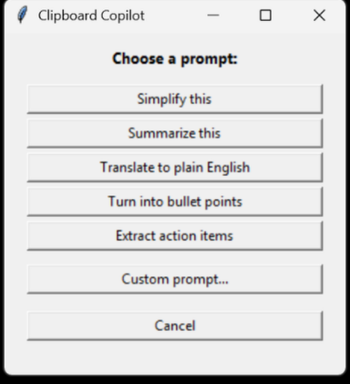
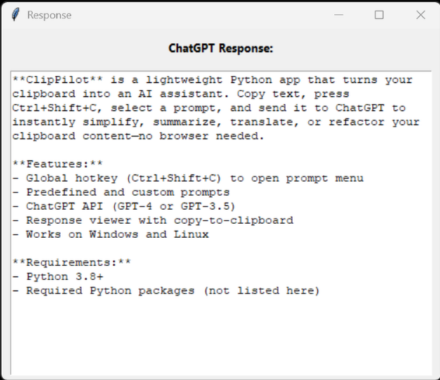

# 📋 Clipboard Copilot (ClipPilot)

Clipboard Copilot is a lightweight Python app that transforms your clipboard into an AI-powered assistant. Just copy any text, hit `Ctrl+Shift+C` (or any other configurable hotkey), and choose a prompt to send it to ChatGPT. Instantly simplify, summarize, translate, or refactor your clipboard content—without ever opening a browser.

---

## 🚀 Features

- Configurable hotkey (default: `Ctrl+Shift+C`) to launch prompt menu  
- Predefined common prompts
- ChatGPT API integration (via Azure AI Foundry)  
- Response viewer with copy-to-clipboard that you can also reply to the prompt for more details and refining requests all within the GUI

---

## 🖼️ Screenshots

### 📋 Prompt Menu


### 🧠 Sample Response


---

## 🛠️ Requirements

Install Python 3.8+ and the following packages:

```bash
pip install -r requirements.txt
```

## 🧠 How to Use

1. **Copy any text** to your clipboard.  
2. **Press `Ctrl+Shift+C`** to open the prompt menu.  
3. **Choose a prompt** (e.g. "Simplify this", "Summarize this", or enter a custom one).  
4. The app sends your clipboard + prompt to ChatGPT via your Azure endpoint.  
5. **View the response** in a popup window and optionally copy it back to your clipboard.  
6. **Press `Esc` or click "Cancel"** to dismiss the menu without sending anything.

---

## 🛡️ Privacy Note

This app sends clipboard content to the Azure OpenAI API for processing.  
Be mindful of sensitive information—such as passwords, personal messages, or confidential data—before triggering a prompt.

You can add filters, redaction logic, or confirmation prompts to enhance privacy.  
For more details on how your data is handled, refer to [Microsoft's Privacy Statement](https://privacy.microsoft.com/en-us/privacystatement).
